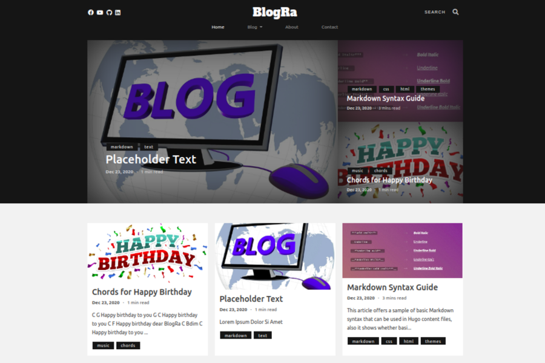

# BlogRa

The Ultimate Tech Blogging Theme



## Features

#### Site features

- Google search bar
- Google Analytics
- Share bar below articles for sharing across social media
- Add links to other presences on the web
- Comments with Disqus
- Customizable navbar
- Mobile responsive- works great across desktops, tablets and mobiles
- SEO friendly (Opengraph, Twitter cards)

#### Blogging features

- Attractive landing page with article/tag links everywhere
- Add featured images to posts
- Making sections for related articles (for example tutorials on a topic)
- Add code snippets
- Add math equations
- Add diagrams with mermaid
- Add tags to articles and list articles by tags

## Installation & Update

You will need to download Hugo **extended versions** to build your site with this theme. Search and download it from the [releases](https://github.com/gohugoio/hugo/releases) page.

```
$ # install
$ mkdir themes
$ cd themes
$ git submodule add https://github.com/rafed/BlogRa.git BlogRa

$ # update
$ git submodule update --remote --merge
```

If you want to know more information, see [Hugo doc](https://gohugo.io/themes/installing/).

#### `config.toml` example

```
baseURL = "https://example.com/"
#CanonifyURLs=true
pluralizeListTitles = false
summaryLength   = 25

theme           = "BlogRa"
languageCode    = "en-us"
title           = "BlogRa Theme"

disqusShortname = ""
googleAnalytics = ""

[params]
    description  = "The Ultimate Tech Blogging Theme"
    contactEmail = "your-email@domain.com"
    footer       = ""
    googleSearch = "google-cse-key"
    adsense      = "adsense-key"
    math         = false   # best to enable this in the front matter of a page
    mermaid      = false   # best to enable this in the front matter of a page

    # Social Media Params
    facebook   = "https://www.facebook.com/DevHacker-2351204168278028"
    twitter    = ""
    youtube    = "https://www.youtube.com/channel/UC6uDg4IlPbLh2xNKrqnBczw"
    instagram  = ""
    github     = "https://github.com/rafed"
    pinterest  = ""
    linkedin   = "https://www.linkedin.com/in/rafed-m-yasir/"


# Configure the site menu here
[menu]
    [[menu.main]]
        name = "Home"
        url = "/"
        weight = 1

    [[menu.main]]
        identifier = "blog"
        name = "Blog"
        weight = 2
            [[menu.main]]
                parent = "blog"
                name = "Posts"
                url = "/posts/"
                weight = 1
            [[menu.main]]
                parent = "blog"
                name = "Sections"
                url = "/sections/"
                weight = 2
            [[menu.main]]
                parent = "blog"
                name = "divider"
                weight = 3
            [[menu.main]]
                parent = "blog"
                name = "Tags"
                url = "/tags/"
                weight = 4
    [[menu.main]]
        name = "About"
        url = "/about/"
        weight = 3
    [[menu.main]]
        name = "Contact"
        url = "/contact/"
        weight = 4

# Don't touch this
[markup.goldmark.renderer]
    unsafe = true
```

## Frontmatter example

```
---
title: {{ replace .Name "-" " " | title }}
date: {{ now.Format "2006-01-2" }}
tags: [tag1, tag2]
image: "/image/blog-pic.jpg"
description: "A smalll description"
showDate: true/false    # to enable/disable showing dates
math: true              # to enable showing equations (katex)
mermaid: true           # to add diagrams using mermaid
---
```

## Contributing

If you find problems with the theme raise an issue. Also, contributions/pull requests are welcome.

## LICENSE

[GPL](./LICENSE).